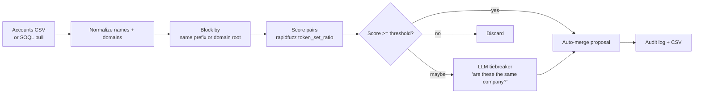

# salesforce-dedupe-merge

Dedupe Salesforce accounts and contacts the way they should be deduped: with a blocking step that doesn't compare every pair to every other pair, a fuzzy match score that reflects how humans actually compare strings, and an LLM tiebreaker for the borderline cases that cost RevOps the most cycles. Ships with a dry-run mode that produces a CSV of proposed merges so a human can sign off before anything writes back to SFDC.

## The GTM problem this solves

Duplicate accounts are the silent tax on every Salesforce instance over two years old. Native Salesforce dedupe rules can't handle "Acme, Inc." vs "ACME Inc" vs "Acme Holdings (formerly Acme)" without producing 100 false positives for every real merge. Vendors charge five figures for a tool that does this. The actual algorithm is well-known — normalize, block, score, threshold, escalate the maybes — and this repo implements it cleanly.

## Quick start

```bash
pip install -r requirements.txt
python -m sfdedupe.cli scan --input data/accounts.csv --threshold 88 --out proposals.csv
# Review proposals.csv, then:
python -m sfdedupe.cli merge --proposals proposals.csv --apply
```

Dry-run is the default. `--apply` is what flips it from "give me a CSV" to "actually call the SFDC merge API."

## How it works



## Design choices

**Blocking is the only thing that makes this scale.** Comparing 100k accounts pairwise is 5 billion pairs. Blocking by `name[:4]` or `root_domain` reduces it to thousands of comparisons per block. The block keys are configurable.

**Scoring is `token_set_ratio` from rapidfuzz.** It handles word reordering, missing punctuation, and common suffixes (`Inc`, `LLC`) better than `ratio` or `partial_ratio` for company-name matching.

**LLM tiebreaker only on the band you can't decide.** Anything above `auto_threshold` is queued for merge. Anything between `escalate_threshold` and `auto_threshold` goes to the LLM with both records' full context. This keeps the bill bounded.

**Audit log every merge.** Every merge proposal records both source records' full state, the score, the block key, and (if used) the LLM's reason. So a year from now when somebody asks "why did Acme Inc absorb Acme Holdings," you can answer.

## Layout

```
src/sfdedupe/
  normalize.py    Canonical name + domain normalization
  block.py        Block-key generators
  score.py        Pair scoring with rapidfuzz
  llm.py          Tiebreaker prompt
  sfdc.py         Salesforce API client (with mock for tests)
  cli.py          scan, merge
data/
  accounts.csv    150 sample accounts with planted duplicates
```

MIT.
